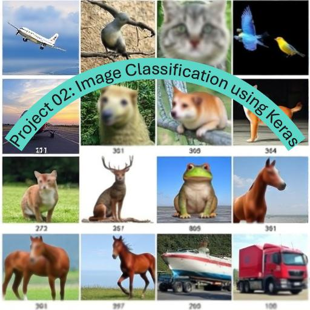

  
The CIFAR-10 dataset is a widely used dataset for machine learning and computer vision tasks.  
It consists of 60,000 32x32 color images in 10 different classes, with 6,000 images per class.  
The dataset is divided into 50,000 training images and 10,000 test images.  
The classes of the images are :  
1) aeroplane
2) automobile
3) bird
4) cat
5) deer
6) dog
7) frog
8) horse
9) ship
10) truck

In this project i used the following libraries:
--> tensorflow keras  
--> matplotlib  
--> numpy  
--> PIL 
--> tkinter  (in oredr to show the algorithm in graphical window sp you can upload your prefered image and then click to classify image button and it gives you the result of the predicted image.)  

